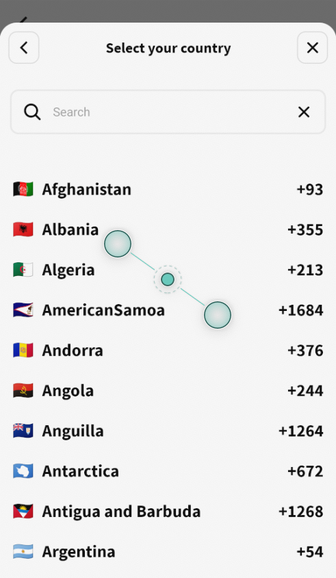

# Country list with dial code and flag

## Usage

`import CountryList from 'country-list-with-dial-code-and-flag'`

```
CountryList.findFlag('mm'); // get specific flag
CountryList.getList(); // get all list
CountryList.findFlagsByDialCode('+44') // get list of flag with dial code +44
CountryList.findFlagByDialCode('+44') // get preferred flag with dial code +44
```

- result will be inArray

```
[
 { "name": "Afghanistan", "dial_code": "+93", "code": "AF", "flag": "🇦🇫" },
 { "name": "Myanmar", "dial_code": "+95", "code": "MM", "flag": "🇲🇲" } ...
]
```



